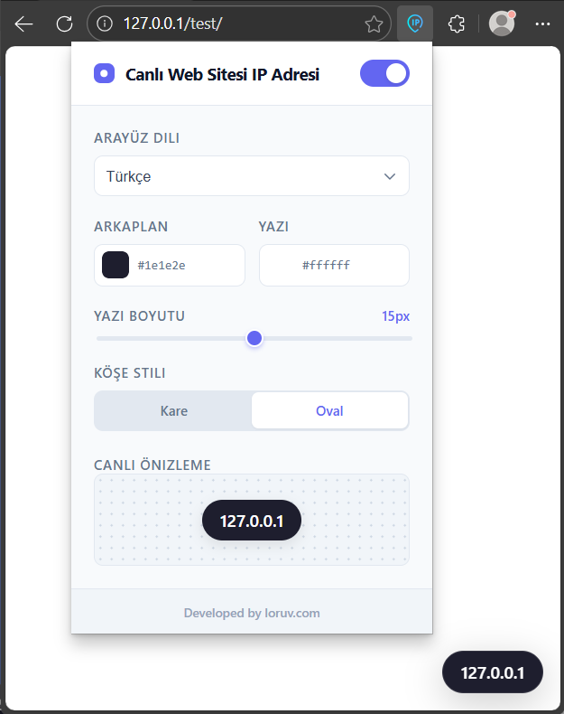
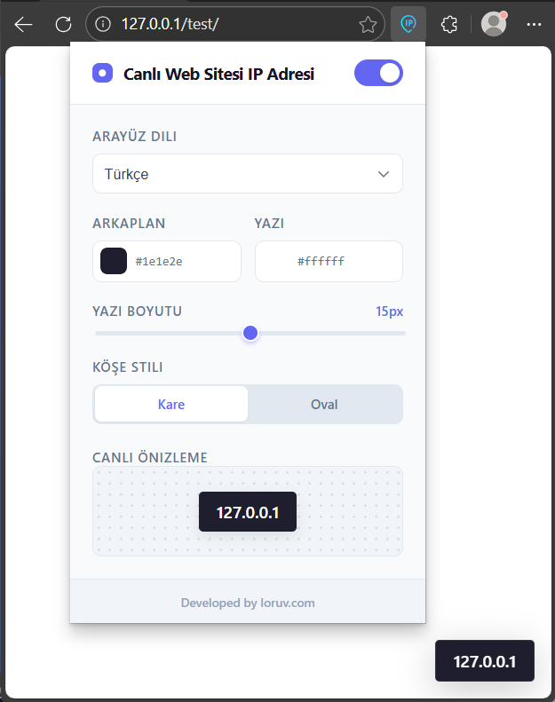
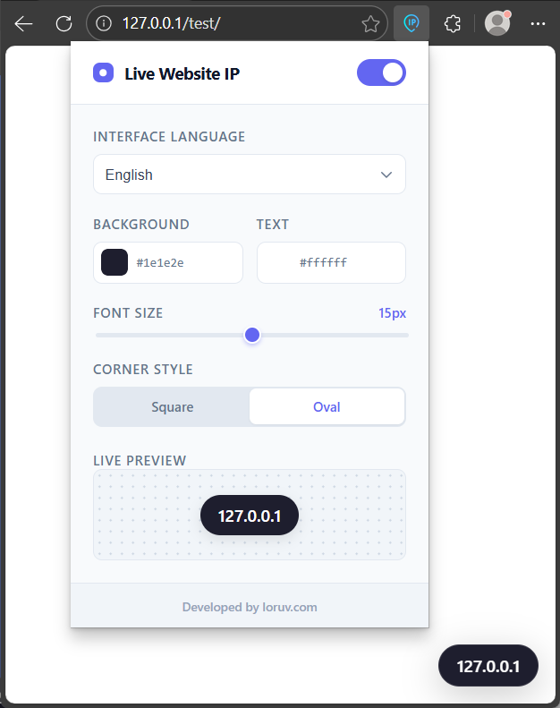
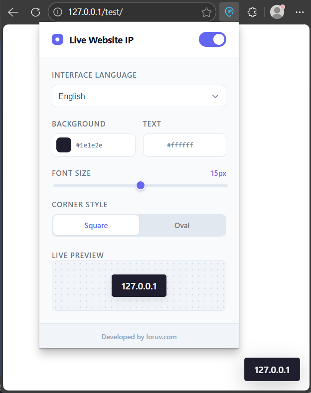

# [TR] Canlı Web Sitesi IP Kontrolü (Web Eklentisi) | [EN] Live Website IP Checker (Web Extension)

[🇹🇷 Türkçe](#türkçe) | [🇬🇧 English](#english) | [🇹🇷 Ekran Görüntüleri](#ekran-görüntüleri) | [🇬🇧 Screenshots](#screenshots)

---

## Türkçe

Harici DNS sorgusu yapmadan, tarayıcı API'si ile bağlandığınız gerçek sunucu IP'sini anlık gösteren hafif bir araç. DNS yayılımı ve CDN testleri için ideal.

Google Web Store: [https://go.emrecb.com/canli-web-sitesi-ip-kontrolu-web-store](https://go.emrecb.com/canli-web-sitesi-ip-kontrolu-web-store)

### 🚀 Öne Çıkan Özellikler

* **%100 Doğru Veri:** Diğer eklentilerin aksine harici DNS sorguları yapmaz; tarayıcının kurduğu aktif TCP bağlantısının fiziksel IP adresini doğrudan görüntüler.
* **DNS Yayılım Takibi:** Yeni bir sunucuya taşınma aşamasında, sitenin eski mi yoksa yeni IP'den mi geldiğini kesin olarak doğrulamanızı sağlar.
* **Shadow DOM İzolasyonu:** IP kutucuğu bir **Shadow Root** içinde hapsedilmiştir; bu sayede web sitesinin kendi CSS kurallarından etkilenmez.
* **Akıllı Etkileşim:** IP kutusunun üzerine gelindiğinde, içeriği kapatmamak için otomatik olarak zıt köşeye geçer.
* **Tam Özelleştirilebilir:** Arka plan rengi, yazı boyutu ve köşe stili (Kare/Oval) anlık olarak ayarlanabilir.

### 🛠 Teknik Detaylar

* **Manifest:** V3
* **Ağ İzleme:** `chrome.webRequest.onResponseStarted` API'si ile gerçek zamanlı IP yakalama.
* **Veri Yönetimi:** `chrome.storage.local` ile kullanıcı tercihlerinin saklanması.

---

## English

Lightweight tool showing real server IP via browser API, avoiding external DNS lookups. Perfect for DNS propagation and CDN testing.

Google Web Store: [https://go.emrecb.com/live-website-ip-checker-web-store](https://go.emrecb.com/live-website-ip-checker-web-store)

### 🚀 Key Features

* **100% Accurate Data:** Unlike other extensions, it does not perform external DNS lookups; it directly displays the physical IP address of the active TCP connection.
* **DNS Propagation Tracking:** Allows you to verify whether the site is served from the old or new IP during server migration.
* **Shadow DOM Isolation:** The IP box is encapsulated within a **Shadow Root**, ensuring it is not affected by the website's own CSS.
* **Smart Interaction:** The IP box automatically shifts to the opposite corner on hover to avoid blocking content.
* **Fully Customizable:** Background color, font size, and corner style (Square/Oval) can be adjusted in real-time.

### 🛠 Technical Stack

* **Manifest:** V3
* **Network Monitoring:** Real-time IP capture using `chrome.webRequest.onResponseStarted` API.
* **Data Management:** User preferences stored via `chrome.storage.local`.

---

## Ekran Görüntüleri

---

## Screenshots

